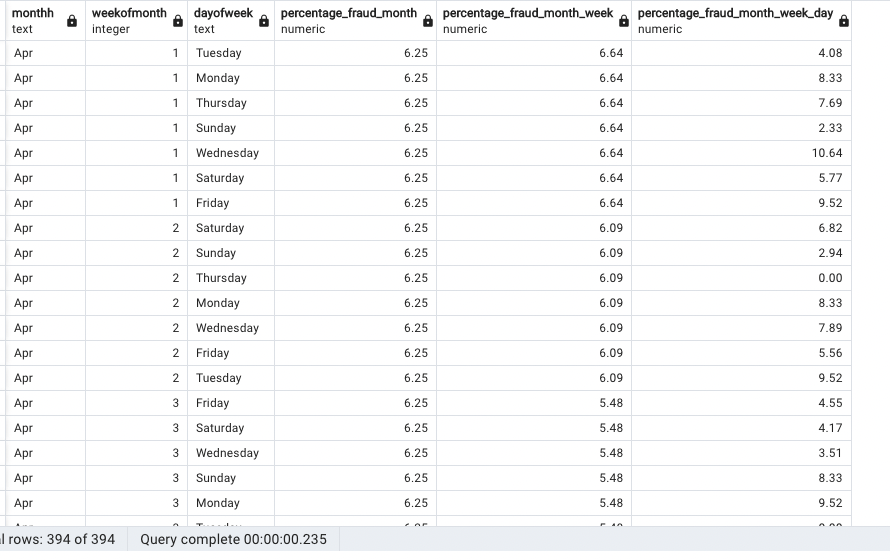

# PRUEBA DATA SCIENTIST R5 #

Los principales proyectos de R5 vienen encaminados al sector vehículos. Usted deberá apoyarse de sus conocimientos para cumplir el siguiente objetivo:

* **Reducir perdidas por fraude en las reclamaciones de siniestro**

¿Qué debe incluir tu solución?

1) Cree una base de datos en PostgreSql (puede ser local) que debe contener una tabla llamada "fraudes" con la información contenida en ./data/fraude.csv. (el archivo ./data/create_table.txt te ayudará)

2) Con su base de datos cargada, replique la siguiente salida sin usar subconsultas.

3) conéctese desde Python a la tabla fraudes (la de la base de datos creada, no directamente del .csv) y léala con un query que la traiga lo más limpia posible.

4) en la carpeta *./notebooks* desarrolle la solución que debe contener un análisis descriptivo de los datos y un modelo de machine learning que ayude a cumplir los objetivos (no se enrede mucho con hacer el mejor modelo, enfóquese en que sea algo funcional).

5) automaticé su pipeline de entrenamiento en el archivo *train.py*, imprimiendo por consola o exportando los principales hallazgos. Exporte el modelo y lo guarda en la carpeta *./models*. En el archivo *predict.py* escriba el pipeline de predicción, pruébelo con el caso particular que usted desee e imprima por consola este caso y su valor predicho (en probabilidades puede ser).

6) Comenta como utilizaría el negocio este modelo para reducir las perdidas por fraude, como lo evaluarías frente a las necesidades del negocio (diferente a las métricas ya usadas) y comenta brevemente como llevarías a producción este proyecto.

* Nota1: Crea un repositorio que contenga en el readme.md las instrucciones necesarias para instalar y correr tu proyecto.

* Nota2: Muchos éxitos!, cualquier duda puedes escribirme por wp: 3113716605, en serio, cualquier duda.

## DICCIONARIO DE DATOS:

Columnas (Columns):

* 00) Month: mes en el que ocurrió el accidente. (Month in which the accident occured)

* 01) WeekOfMonth: semana en la que ocurrió el accidente. (Week in the month of accident)

* 02) DayOfWeek: Día de la semana en que ocurrió el accidente. (Day of the week of the accident)

* 03) Make: Marca del vehículo. (Car maker)

* 04) AccidentArea: Si el accidente fue en un área rural o urbana. (Accident occured in rural or urban area)

* 05) DayOfWeekClaimed: Día de la semana en la que se hizo la denuncia, "controlar ceros". (Day of the week the accident was claimed, "control zeros")

* 06) MonthClaimed: Mes en el que se hizo la denuncia, "controlar ceros". (Month the accident was claimed, "control zeros")

* 07) WeekOfMonthClaimed: Número de semana del mes en la que se hizo la denuncia. (Week in the month of accident)

* 08) Sex: Género de la persona que realiza la denuncia. (Gender of the person involved in the accident)

* 09) MaritalStatus: Estado cívil de la persona que hace la denuncia. (Marital status of the person involved in the accident)

* 10) Age: Edad de la persona que hace la denuncia. (Age of the person involved in the accident)

* 11) Fault: Si el culpable fue el dueño del seguro u otro involucrado. (If the insurance owner was responsable of the accident)

* 12) PolicyType: Combinación de tipo de auto y de tipo de póliza: Liability (contra terceros), Collision (Incluye daños al vehículo del propietario), All Perils (contra todo riesgo). (Combination between Vehicle Category and Base Policy)

* 13) VehicleCatergory: Clasificación de tipo de auto. (Vehicle categorization)

* 14) VehiclePrice: Precio del vehículo. (Price of the vehicle)

* 15) FraudFound_P: Si el incidente fue fraudulento o no)

* 16) PolicyNumber: Número único de accidente, coincide con el número de filas del dataset. (Unique number of each entry)

* 17) RepNumber: Numeración entre 1 y 16. (Enumeration between 1 and 16)

* 18) Deductible: Costo del seguro. (Ensurance cost)

* 19) DriverRating: Calificación del piloto, puede ser data ordinal. (This driver rating might be ordinal)

* 20) Days_Policy_Accident: Rango adquisición del seguro y suceso del accidente. (Days between ensurance is acquired and the accident occured)

* 21) Days_Policy_Claim: Rango entre adquisición del seguro y denuncia del accidente. (Days between ensurance is acquired and the accident was claimed)

* 22) PastNumberOfClaims: Cantidad de denuncias anteriores realizadas por el dueño del vehículo. (Number of past claims of the ensurance owner)

* 23) AgeOfVehicle: Edad del vehículo.

* 24) AgeOfPolicyHolder: Edad del dueño del seguro.

* 25) PoliceReportFiled: Si fue denunciado a la policía. (If the accident was reported to the police)

* 26) WitnessPresent: Si hay testigos.

* 27) AgentType: Internos son cuando el fraude es realizado por personas trabajando en la empresa de seguros. Externos son los fraudes en los que el seguro es engañado por personas independientes 

* 28) NumberOfSuppliments: Son daños al vehículo no registrados a la hora de la denuncia, daños extras que no se ven por el exterior, normalmente roturas en componentes internos como suspensión, chasis, etc.

* 30) NumberOfCars: Número de autos involucrados en el accidente. 

* 31) Year: Año en el que ocurrió el accidente.

* 32) BasePolicy: Tipo de seguro, igual a PolicyType. (Tipe of ensurance)

